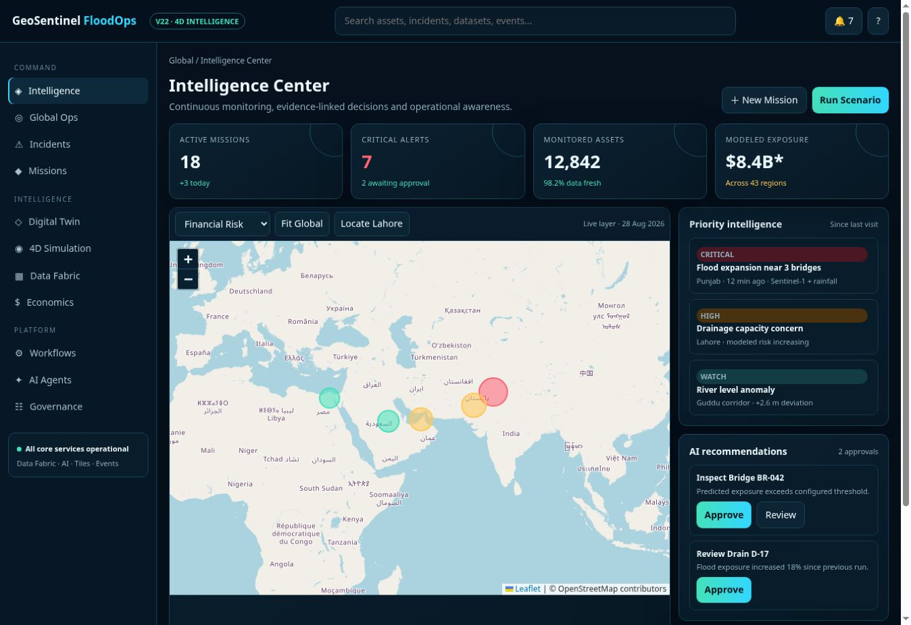
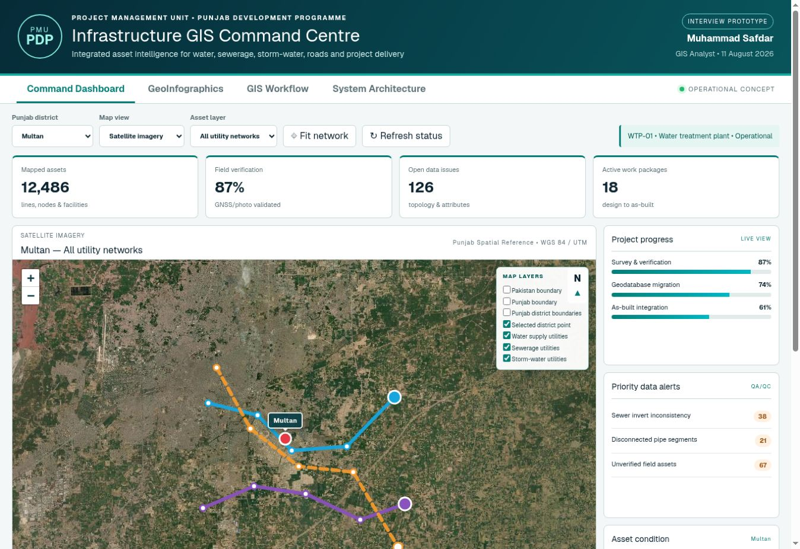
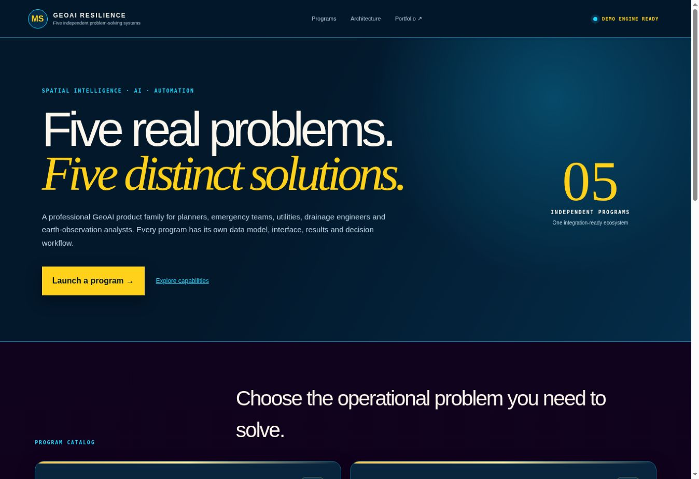
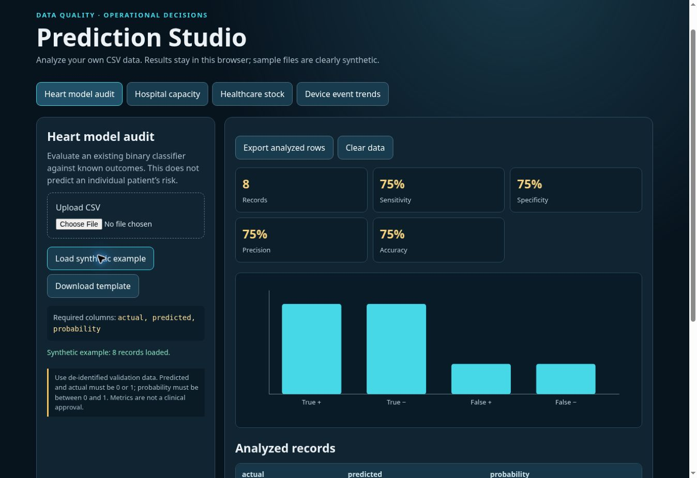
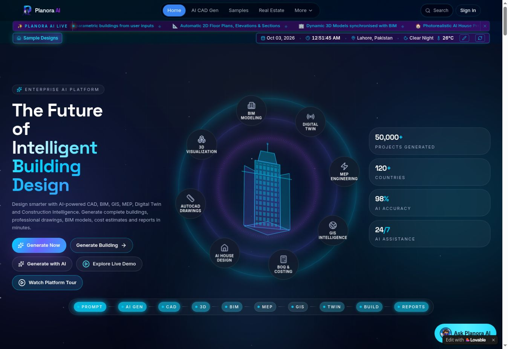
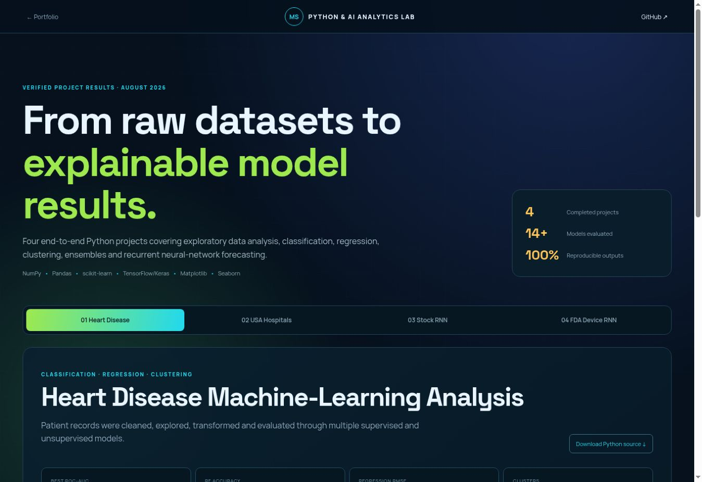

# Muhammad Safdar — Data Science, AI/ML, GeoAI & Spatial Intelligence Portfolio

Source for [safdar404.github.io](https://safdar404.github.io), the public portfolio of Muhammad Safdar — Data Scientist, AI/ML Engineer, Python practitioner and GeoAI Specialist.

The portfolio brings together 10+ years of data and geospatial delivery across enterprise GIS, remote sensing, infrastructure, utilities, agriculture, disaster intelligence, engineering AI and spatial decision support.

## Featured: GeoAI Site Intelligence Suite

A three-application AI/GeoAI spatial decision-support case study combining **Python, AI/ML, GIS, Leaflet, MCDA, remote sensing and site-selection workflows**.

### Applications

- **[MERIDIAN PRO — AI Geospatial Suitability Platform](https://safdar404.github.io/geoai-site-intelligence/meridian-pro.html)** — configurable suitability criteria, spatial scoring, candidate ranking and map-based decision support.
- **[GEOSENTINEL PRO — Flood Mitigation Siting Platform](https://safdar404.github.io/geoai-site-intelligence/geosentinel-pro.html)** — flood hazard, exposure and spatial suitability for intervention prioritization.
- **[SOLARIS PRO — Utility-Scale Solar Siting Platform](https://safdar404.github.io/geoai-site-intelligence/solaris-pro.html)** — terrain, infrastructure, environmental constraints and candidate solar-site screening.

**[🚀 Open the complete GeoAI Site Intelligence Suite](https://safdar404.github.io/geoai-site-intelligence/)** · **[📁 Open project source folder](https://github.com/safdar404/safdar404.github.io/tree/main/geoai-site-intelligence)**

### Analytical workflow

`Problem definition → spatial/EO data → preprocessing → criteria → weights/MCDA → AI/ML/GeoAI analysis → candidate scoring → ranking → interactive decision support`

> These applications are portfolio-grade decision-support prototypes. Operational use requires authoritative datasets, documented data provenance, uncertainty/sensitivity analysis, engineering and regulatory checks, and expert validation.

## Technology

- Semantic HTML5
- Responsive CSS
- Vanilla JavaScript
- Leaflet web mapping
- Python / AI/ML / GeoAI concepts
- GIS / remote sensing / MCDA
- GitHub Pages deployment

## Islamabad Feature Intelligence

[**Open the live Islamabad dashboard**](https://islamabad-feature-intelligence.safdarwatto7714.chatgpt.site)

An interactive ArcGIS and Python geospatial project covering Islamabad, combining **16,704 OSM building footprints** with **228,921 additional Microsoft ML footprints** into a **245,625-feature Building Footprints view**. Residential, commercial, industrial, other tagged use and unknown-use categories have independent filters and polygon colors.

- Reference roads, waterways, water bodies and land-use areas alongside Sentinel-2 vegetation, water and built-up / bare-soil screening.
- Dated Sentinel-2B imagery (23 February 2026), spectral indices and unsupervised ML clusters for broad land-cover context.
- Interactive 3D-style pie and bar charts with category area, percentage and source details; Power BI-ready data and setup kit.
- Shapefile ZIPs for ten vector datasets, GeoJSON, raster data, map/chart PNG and PDF exports, and analysis reports.

<em>Sentinel-2B L2A analysis · 23 February 2026 · false color, NDVI and candidate land-cover screening.</em>

<em>Live dashboard chart panel · mapped land use across the full Islamabad boundary. Unmapped land use is shown explicitly.</em>

**Tools:** ArcGIS Maps SDK for JavaScript · Python · GeoPandas · Rasterio · scikit-learn · Sentinel-2 · OpenStreetMap · Microsoft Global ML Building Footprints

*Building footprints are reference geometry, not legal cadastral parcels. Source coverage is incomplete, ML property use is unknown, and spectral candidates require validation. The dashboard provides Power BI-ready materials rather than an embedded Power BI report.*

---

## Live AI & GeoAI Applications

### HIS AI Agentic Solutions

[**Open live app →**](https://his-ai-agentic-solutions.lovable.app/)

An AI engineering and automation showcase connecting data, specialist agents, tools, validation and human approval in a clear workflow.

- Synthetic document-review, GeoAI assessment and data-quality demonstrations.
- A specialist-agent catalogue and visible execution logs, review briefs and approval checkpoints.
- Explores AI engineering, retrieval-augmented generation, geospatial pipelines and business automation.

<em>Actual homepage and synthetic workflow sandbox.</em>

**Focus:** Agentic workflows · Human review · GeoAI

### GeoSentinel AI

[**Open live app →**](https://geosentinel-ai-1.ai.studio/)

A geospatial decision-support dashboard demonstrating flood intelligence and municipal incident-management workflows, with the Nullah Lai and Margalla catchment as a featured context.

- Basin selection, map-based incident triage, risk summaries and analytical views.
- Evidence fusion, incident intelligence, work-order verification and GeoAI-agent interfaces.
- Connects the observe → assess → act → verify workflow in one interactive application.

<em>Actual command-center interface; displayed telemetry and metrics are demonstration content unless independently verified.</em>

**Focus:** Web GIS · Flood intelligence · Incident workflows

### AI HealthAssist

[**Open live app →**](https://ai-healthassist.ai.studio/)

An educational clinical decision-support prototype combining structured intake, symptom and vital-sign capture, clinical history, laboratory inputs and geographic context.

- A five-stage intake workflow and preset clinical test scenarios.
- Interactive calculator views for MAP/pulse pressure, eGFR, CHA₂DS₂-VASc and BMI/BSA.
- Demonstrates clinician-oriented review and public-health surveillance interfaces.

<em>Actual calculator panel, cropped to exclude patient identifiers. Educational prototype; not a substitute for clinical diagnosis or treatment.</em>

**Focus:** Structured intake · Clinical calculators · Health GIS

## 🚀 Selected projects

Individual project showcases with screenshots where public interfaces are accessible, and labeled overview graphics for source-based or legacy projects.

### AI HealthAssist

An educational healthcare decision-support prototype combining structured intake, symptom and vital-sign capture, clinical history, laboratory inputs and geographic context.

- Five-stage intake and preset clinical test scenarios.
- Interactive MAP/pulse pressure, eGFR, CHA₂DS₂-VASc and BMI/BSA calculator views.
- Clinician-oriented review and public-health surveillance interfaces.

**Focus:** Structured intake · Clinical calculators · Health GIS  
[**View project →**](https://ai-healthassist.ai.studio/) · [Source](https://github.com/safdar404/HIS-AI-HealthAssist)

*Actual calculator screenshot with patient identifiers excluded. Educational use; does not replace professional diagnosis or treatment.*

### GeoSentinel FloodOps

An interactive global flood and water-intelligence demonstration linking geographic context, modeled exposure, incidents, missions and review-oriented recommendations.

- Leaflet map views for flood exposure, critical assets, events and modeled financial risk.
- Intelligence Center, Digital Twin, 4D Simulation, Data Fabric and governance workspaces.
- Recommendation review and approval interfaces illustrating the observe → assess → decide → act workflow.

**Focus:** Leaflet · Flood intelligence · Human review  
[**View project →**](https://safdar404.github.io/geosentinel-floodops/) · [Source](https://github.com/safdar404/safdar404.github.io/tree/main/geosentinel-floodops)

*Actual interface screenshot. Displayed alerts, exposure values and operational metrics are illustrative; they are not verified live events or losses.*

### Pakistan Infrastructure GIS Command Centre

A Punjab infrastructure GIS prototype bringing utility networks, asset condition, field verification, project progress and data-quality issues into one command dashboard.

- District, map-theme and water/sewerage/storm-water layer selectors.
- Satellite basemap with schematic utility overlays and progress/QA summaries.
- GIS workflow, geoinfographics and system-architecture views connecting survey, QA/QC, enterprise data and decisions.

**Focus:** Infrastructure GIS · Utilities · Project monitoring  
[**View project →**](https://pmu-pdp-infrastructure-gis.neat-grove-8624.chatgpt.site/)

*Actual dashboard screenshot. Interview prototype with illustrative assets and non-operational metrics.*

### GeoAI Resilience Intelligence Suite

A five-program spatial decision-support suite supported by a Python research toolkit for urban growth, flood response, utility risk, drainage capacity and Earth-observation change.

- Independent Urban Intelligence, Flood Intelligence, Utility Guardian, Drainage Lab and Earth Change AI workflows.
- Reference methods covering weighted suitability, hazard/exposure screening, asset consequence, runoff-capacity gaps and spectral change.
- Deterministic web workbench demonstrations with layer controls, analytical records and documented uncertainty.

**Focus:** Python · GeoAI · GIS · Hydrology  
[**View project →**](https://geoai-resilience-intelligence-suite.neat-grove-8624.chatgpt.site/) · [Source](https://github.com/safdar404/geoai-resilience-research-lab)

*Actual suite homepage. Research and demonstration software; the browser does not run licensed ArcGIS Pro or local QGIS.*

### Pakistan National Flood Intelligence

A national flood-planning dashboard combining dated disaster-impact context, river and reservoir summaries, district screening and phase-specific response views.

- District risk screening and present, 24-hour, 72-hour, stress-test and recovery scenarios documented in the repository.
- Mitigation, preparedness, response and rehabilitation planning views.
- Map themes, exposed-asset indicators and infrastructure-damage context.

**Focus:** React · TypeScript · GeoJSON · Disaster planning  
[**View project →**](https://pakistan-flood-intelligence-2026.neat-grove-8624.chatgpt.site/) · [Source](https://github.com/safdar404/Pakistan-National-Flood-Intelligence)

*Project overview graphic, not an app screenshot. Demo currently requires sign-in. Scenario indices are qualitative planning indicators; dated observations are not current readings.*

### Prediction Studio

A browser-based CSV analytics workspace with transparent calculations for heart-model audits, hospital capacity, healthcare inventory and device-event trends.

- Upload CSVs or load clearly labeled synthetic examples with row-level validation.
- Inspect sensitivity, specificity, precision and accuracy for existing labeled classifier outputs.
- Analyze capacity and stock-planning indicators, view hover-enabled charts and export analyzed records.

**Focus:** CSV analytics · Model evaluation · Client-side JavaScript  
[**View project →**](https://safdar404.github.io/prediction-studio/) · [Source](https://github.com/safdar404/Fullstack-AI-BOOTCAMP-B-10)

*Actual screenshot using eight synthetic records. The heart workflow audits an existing model; it does not diagnose patients or predict individual risk.*

### LangChain RAG Document Assistant

A document-intelligence project demonstrating a traceable retrieval-augmented generation pipeline from document ingestion to source-aware answers.

- PDF, TXT and Markdown ingestion, normalization and overlapping text chunks.
- Embedding-based semantic retrieval and SingleStore vector storage documented in the source.
- Grounded question answering, source citations and retrieval inspection.

**Focus:** Python · LangChain · Vector search · SingleStore  
[**View project →**](https://langchain-rag-document-assistant.neat-grove-8624.chatgpt.site/) · [Source](https://github.com/safdar404/LangChain-RAG-Application)

*Project overview graphic, not an app screenshot. Demo currently requires sign-in; capabilities are described from the public repository.*

### MEP Scanner System

A Python engineering-document scanner that associates OCR-detected MEP components with nearby dimensions, airflow values and equipment tags.

- PDF/image rendering and configurable drawing preprocessing with local EasyOCR.
- Editable detections, confidence thresholds, component filters and missing-field QA flags.
- Original-page and OCR review plus formatted multi-sheet Excel reporting.

**Focus:** Python · EasyOCR · OpenCV · Streamlit  
[**View project →**](https://mep-scanner-system.neat-grove-8624.chatgpt.site/) · [Source](https://github.com/safdar404/HIS-MEP-Scanner-System.)

*Project overview graphic, not an app screenshot. Demo currently requires sign-in. OCR findings must be checked against approved drawings.*

### Planora AI — CAD, BIM & GIS Flow

An AI-assisted built-environment application showcasing a connected project brief, CAD, 3D, BIM, MEP, GIS, costing and digital-twin workflow.

- Project-brief templates and spatial inputs using coordinates, GeoJSON or KML/KMZ.
- Preview interfaces for floor plans, massing, BIM objects, MEP routing and site context.
- Cost/BOQ, construction planning and reporting concepts organized around a shared building model.

**Focus:** CAD · BIM–GIS · 3D · Digital Twin  
[**View project →**](https://ai-cad-bim-flow.lovable.app/) · [Source (private)](https://github.com/safdar404/AI-Cad-Bim-Flow)

*Actual homepage screenshot. Source repository is private. Marketing counts and accuracy claims have not been independently validated; engineering outputs require professional review.*

### MEP Drawing Analyzer

A portfolio entry for engineering-drawing analysis and structured MEP information, retained from the selected-project catalogue.

- Focus: interpreting mechanical, electrical and plumbing drawings.
- Focus: organizing drawing information for engineering review.
- Related accessible implementation: MEP Scanner System, with OCR, confidence QA and Excel reporting.

**Focus:** Engineering drawings · MEP · Document analysis  
[**Original project link →**](https://github.com/safdar404/mep-analyzer) · [Related MEP scanner](https://github.com/safdar404/HIS-MEP-Scanner-System.)

*Project overview graphic. The original repository link is currently unavailable; distinct implementation details could not be verified.*

### Alfanar MEP OCR

A legacy MEP OCR project entry whose former alfanar-mep-ocr repository now redirects to HIS MEP Scanner System.

- Drawing-text extraction and structured component review.
- Current successor documents component labels, dimensions, airflow and equipment-tag association.
- Confidence-based QA, original-drawing review and Excel export in the successor implementation.

**Focus:** MEP OCR · Python · Engineering QA  
[**Current repository →**](https://github.com/safdar404/HIS-MEP-Scanner-System.)

*Project overview graphic. Legacy project name retained; links point to its verified current repository.*

### Zarwa Bill Scanner / HIS Bill Scanner

A browser-based invoice and receipt OCR project. The former zarwa-bill-scanner repository now redirects to HIS Bill Scanner.

- Camera capture or document upload with original-document preview.
- Vendor, invoice number/date, currency, totals, tax and line-item extraction documented in the repository.
- Raw-OCR review and CSV export; the documented workflow processes documents locally in the browser.

**Focus:** Tesseract.js · React · TypeScript · Invoice OCR  
[**View project →**](https://his-bill-scanner.neat-grove-8624.chatgpt.site/) · [Source](https://github.com/safdar404/HIS-Bill-Scanner)

*Project overview graphic. Legacy name retained alongside the current repository name. Extracted amounts require review against the original bill.*

### Python & AI Analytics Lab

A four-project Python portfolio showing data preparation, exploratory analysis, classification, regression, clustering, ensembles and recurrent forecasting.

- Heart-disease ML analysis, USA hospital analysis, stock RNN and FDA device RNN project views.
- Model comparisons, evaluation charts, workflow explanations and downloadable Python source.
- A common inspect → clean → explore → model → evaluate → explain pipeline.

**Focus:** Pandas · scikit-learn · TensorFlow/Keras · Visualization  
[**View project →**](https://safdar404.github.io/python-ai-lab/) · [Source](https://github.com/safdar404/Fullstack-AI-BOOTCAMP-B-10)

*Actual lab screenshot. Educational analyses; displayed model metrics are project-specific, not evidence of clinical or financial reliability.*

---

## Other featured live projects

- [Pakistan Infrastructure GIS Command Centre](https://pmu-pdp-infrastructure-gis.neat-grove-8624.chatgpt.site/) — GIS dashboard for infrastructure and transportation planning, project monitoring and spatial decision support.
- [Pakistan National Flood Intelligence System](https://pakistan-flood-intelligence-2026.neat-grove-8624.chatgpt.site)
- [GeoAI Resilience Intelligence Suite](https://geoai-resilience-intelligence-suite.neat-grove-8624.chatgpt.site)
- [Python & AI Analytics Lab](https://safdar404.github.io/python-ai-lab/)
- [Planora AI — AI CAD, BIM & GIS Flow](https://ai-cad-bim-flow.lovable.app/)
- [SMHIS Resume](https://smhisresume.com/)

## Public project repositories

- [Pakistan Infrastructure GIS Command Centre](https://pmu-pdp-infrastructure-gis.neat-grove-8624.chatgpt.site/) — Live demonstration
- [Python Full Stack AI Coursework & Assessment Projects](https://github.com/safdar404/Fullstack-AI-BOOTCAMP-B-10)
- [LangChain RAG Document Assistant](https://github.com/safdar404/LangChain-RAG-Application)
- [Pakistan National Flood Intelligence](https://github.com/safdar404/pakistan-national-flood-intelligence)
- [GeoAI Resilience Research Lab](https://github.com/safdar404/geoai-resilience-research-lab)
- [Planora AI — AI CAD, BIM & GIS Flow](https://github.com/safdar404/ai-cad-bim-flow)
- [MEP Drawing Analyzer](https://github.com/safdar404/mep-analyzer)
- [Alfanar MEP OCR](https://github.com/safdar404/alfanar-mep-ocr)
- [Zarwa Bill Scanner](https://github.com/safdar404/zarwa-bill-scanner)
- [Portfolio source](https://github.com/safdar404/safdar404.github.io)

## Contact

- [LinkedIn](https://www.linkedin.com/in/muhammad-safdar-88b27730)
- [GitHub](https://github.com/safdar404)
- [Professional website](https://smhisresume.com/)
- Email: safdar404@gmail.com
- WhatsApp: +92 322 8792404

© 2026 Muhammad Safdar
