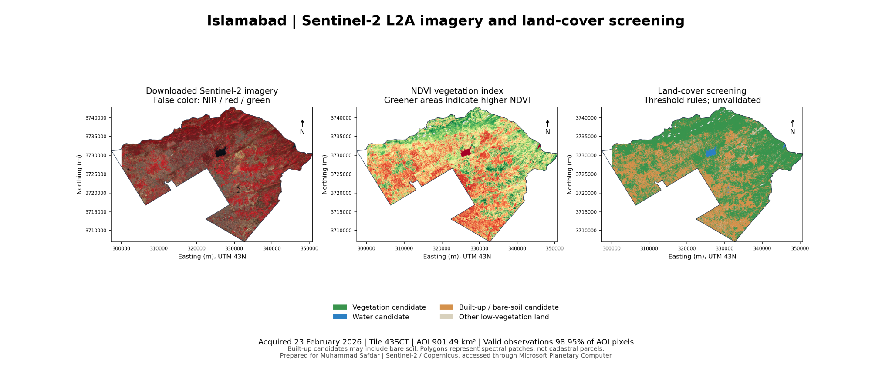
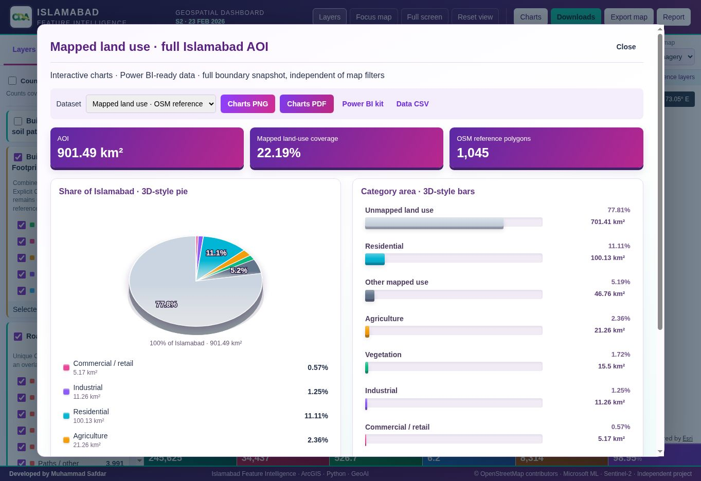
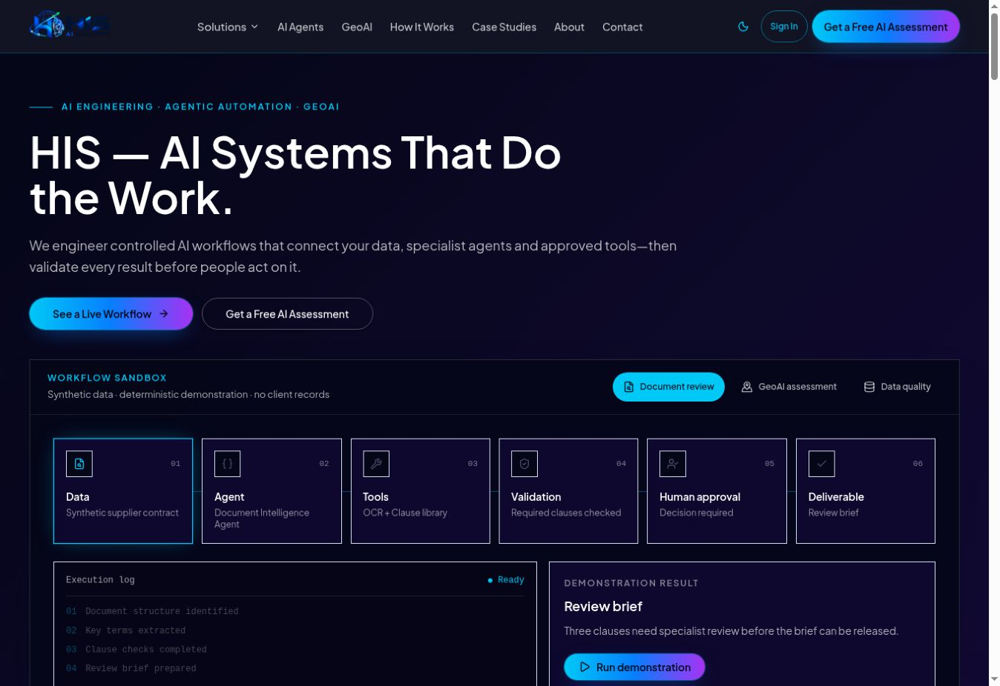
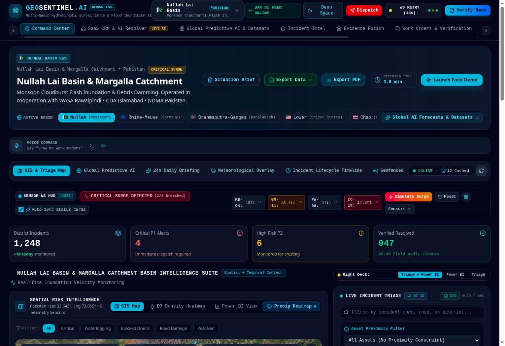
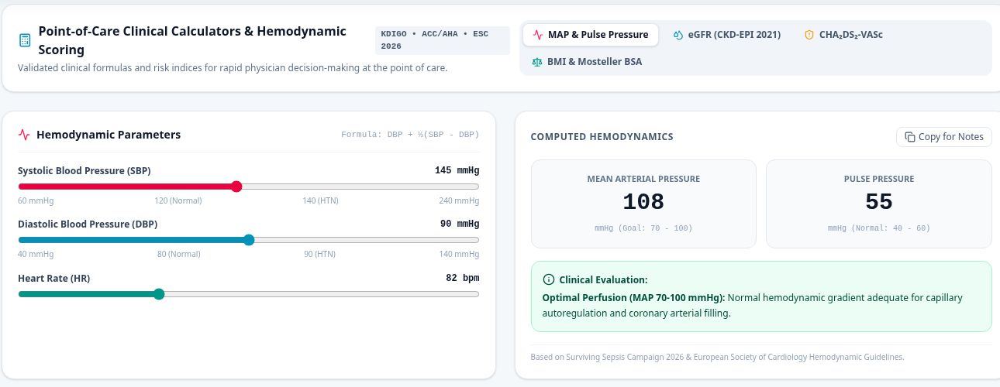

# Muhammad Safdar — Data Science, AI/ML, GeoAI & Spatial Intelligence Portfolio

Source for [safdar404.github.io](https://safdar404.github.io), the public portfolio of Muhammad Safdar — Data Scientist, AI/ML Engineer, Python practitioner and GeoAI Specialist.

The portfolio brings together 10+ years of data and geospatial delivery across enterprise GIS, remote sensing, infrastructure, utilities, agriculture, disaster intelligence, engineering AI and spatial decision support.

## Featured: GeoAI Site Intelligence Suite

A three-application AI/GeoAI spatial decision-support case study combining **Python, AI/ML, GIS, Leaflet, MCDA, remote sensing and site-selection workflows**.

### Applications

- **[MERIDIAN PRO — AI Geospatial Suitability Platform](https://safdar404.github.io/geoai-site-intelligence/meridian-pro.html)** — configurable suitability criteria, spatial scoring, candidate ranking and map-based decision support.
- **[GEOSENTINEL PRO — Flood Mitigation Siting Platform](https://safdar404.github.io/geoai-site-intelligence/geosentinel-pro.html)** — flood hazard, exposure and spatial suitability for intervention prioritization.
- **[SOLARIS PRO — Utility-Scale Solar Siting Platform](https://safdar404.github.io/geoai-site-intelligence/solaris-pro.html)** — terrain, infrastructure, environmental constraints and candidate solar-site screening.

**[🚀 Open the complete GeoAI Site Intelligence Suite](https://safdar404.github.io/geoai-site-intelligence/)** · **[📁 Open project source folder](https://github.com/safdar404/safdar404.github.io/tree/main/geoai-site-intelligence)**

### Analytical workflow

`Problem definition → spatial/EO data → preprocessing → criteria → weights/MCDA → AI/ML/GeoAI analysis → candidate scoring → ranking → interactive decision support`

> These applications are portfolio-grade decision-support prototypes. Operational use requires authoritative datasets, documented data provenance, uncertainty/sensitivity analysis, engineering and regulatory checks, and expert validation.

## Technology

- Semantic HTML5
- Responsive CSS
- Vanilla JavaScript
- Leaflet web mapping
- Python / AI/ML / GeoAI concepts
- GIS / remote sensing / MCDA
- GitHub Pages deployment

## Islamabad Feature Intelligence

[**Open the live Islamabad dashboard**](https://islamabad-feature-intelligence.safdarwatto7714.chatgpt.site)

An interactive ArcGIS and Python geospatial project covering Islamabad, combining **16,704 OSM building footprints** with **228,921 additional Microsoft ML footprints** into a **245,625-feature Building Footprints view**. Residential, commercial, industrial, other tagged use and unknown-use categories have independent filters and polygon colors.

- Reference roads, waterways, water bodies and land-use areas alongside Sentinel-2 vegetation, water and built-up / bare-soil screening.
- Dated Sentinel-2B imagery (23 February 2026), spectral indices and unsupervised ML clusters for broad land-cover context.
- Interactive 3D-style pie and bar charts with category area, percentage and source details; Power BI-ready data and setup kit.
- Shapefile ZIPs for ten vector datasets, GeoJSON, raster data, map/chart PNG and PDF exports, and analysis reports.

<em>Sentinel-2B L2A analysis · 23 February 2026 · false color, NDVI and candidate land-cover screening.</em>

<em>Live dashboard chart panel · mapped land use across the full Islamabad boundary. Unmapped land use is shown explicitly.</em>

**Tools:** ArcGIS Maps SDK for JavaScript · Python · GeoPandas · Rasterio · scikit-learn · Sentinel-2 · OpenStreetMap · Microsoft Global ML Building Footprints

*Building footprints are reference geometry, not legal cadastral parcels. Source coverage is incomplete, ML property use is unknown, and spectral candidates require validation. The dashboard provides Power BI-ready materials rather than an embedded Power BI report.*

---

## Live AI & GeoAI Applications

### HIS AI Agentic Solutions

[**Open live app →**](https://his-ai-agentic-solutions.lovable.app/)

An AI engineering and automation showcase connecting data, specialist agents, tools, validation and human approval in a clear workflow.

- Synthetic document-review, GeoAI assessment and data-quality demonstrations.
- A specialist-agent catalogue and visible execution logs, review briefs and approval checkpoints.
- Explores AI engineering, retrieval-augmented generation, geospatial pipelines and business automation.

<em>Actual homepage and synthetic workflow sandbox.</em>

**Focus:** Agentic workflows · Human review · GeoAI

### GeoSentinel AI

[**Open live app →**](https://geosentinel-ai-1.ai.studio/)

A geospatial decision-support dashboard demonstrating flood intelligence and municipal incident-management workflows, with the Nullah Lai and Margalla catchment as a featured context.

- Basin selection, map-based incident triage, risk summaries and analytical views.
- Evidence fusion, incident intelligence, work-order verification and GeoAI-agent interfaces.
- Connects the observe → assess → act → verify workflow in one interactive application.

<em>Actual command-center interface; displayed telemetry and metrics are demonstration content unless independently verified.</em>

**Focus:** Web GIS · Flood intelligence · Incident workflows

### AI HealthAssist

[**Open live app →**](https://ai-healthassist.ai.studio/)

An educational clinical decision-support prototype combining structured intake, symptom and vital-sign capture, clinical history, laboratory inputs and geographic context.

- A five-stage intake workflow and preset clinical test scenarios.
- Interactive calculator views for MAP/pulse pressure, eGFR, CHA₂DS₂-VASc and BMI/BSA.
- Demonstrates clinician-oriented review and public-health surveillance interfaces.

<em>Actual calculator panel, cropped to exclude patient identifiers. Educational prototype; not a substitute for clinical diagnosis or treatment.</em>

**Focus:** Structured intake · Clinical calculators · Health GIS

## Other featured live projects

- [Pakistan Infrastructure GIS Command Centre](https://pmu-pdp-infrastructure-gis.neat-grove-8624.chatgpt.site/) — GIS dashboard for infrastructure and transportation planning, project monitoring and spatial decision support.
- [Pakistan National Flood Intelligence System](https://pakistan-flood-intelligence-2026.neat-grove-8624.chatgpt.site)
- [GeoAI Resilience Intelligence Suite](https://geoai-resilience-intelligence-suite.neat-grove-8624.chatgpt.site)
- [Python & AI Analytics Lab](https://safdar404.github.io/python-ai-lab/)
- [Planora AI — AI CAD, BIM & GIS Flow](https://ai-cad-bim-flow.lovable.app/)
- [SMHIS Resume](https://smhisresume.com/)

## Public project repositories

- [Pakistan Infrastructure GIS Command Centre](https://pmu-pdp-infrastructure-gis.neat-grove-8624.chatgpt.site/) — Live demonstration
- [Python Full Stack AI Coursework & Assessment Projects](https://github.com/safdar404/Fullstack-AI-BOOTCAMP-B-10)
- [LangChain RAG Document Assistant](https://github.com/safdar404/LangChain-RAG-Application)
- [Pakistan National Flood Intelligence](https://github.com/safdar404/pakistan-national-flood-intelligence)
- [GeoAI Resilience Research Lab](https://github.com/safdar404/geoai-resilience-research-lab)
- [Planora AI — AI CAD, BIM & GIS Flow](https://github.com/safdar404/ai-cad-bim-flow)
- [MEP Drawing Analyzer](https://github.com/safdar404/mep-analyzer)
- [Alfanar MEP OCR](https://github.com/safdar404/alfanar-mep-ocr)
- [Zarwa Bill Scanner](https://github.com/safdar404/zarwa-bill-scanner)
- [Portfolio source](https://github.com/safdar404/safdar404.github.io)

## Contact

- [LinkedIn](https://www.linkedin.com/in/muhammad-safdar-88b27730)
- [GitHub](https://github.com/safdar404)
- [Professional website](https://smhisresume.com/)
- Email: safdar404@gmail.com
- WhatsApp: +92 322 8792404

© 2026 Muhammad Safdar
